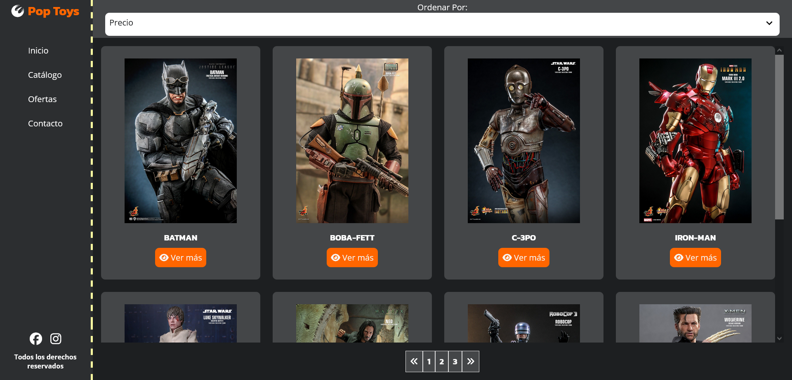

# Desafío 3 - Electric Car Store

## ¡Hola a todos! 👋

En este desafío, he trabajado en el diseño de una página web para una tienda a la cual llamé Pop Toys. Utilicé media queries y breakpoints para crear dos layouts diferentes: uno para dispositivos móviles y otro para escritorio.

## Descripción del Proyecto 🚗

Diseñé la página web con dos layouts distintos: uno para dispositivos móviles y otro para escritorio. Utilicé CSS Grid y Flexbox para organizar las diferentes secciones de la página.

## Resultado Final 🎉

¡Aquí está el resultado final de mi proyecto!

### Observaciones y Recomendaciones 🧐

- La página cuenta con un menú de navegación, una sección de filtros de búsqueda, una sección principal para mostrar los productos y un pie de página.
- Se utilizó CSS Grid y Flexbox para lograr un diseño responsivo y atractivo.
- La página se divide en cuatro secciones: navegación, encabezado, contenido principal y pie de página.
- La versión móvil presenta un ícono de hamburguesa que no tiene interacción, solo visualización.

## Experiencia del Desarrollo 🛠️

Durante este proyecto, apliqué mis conocimientos de media queries y breakpoints para crear un diseño responsivo. Aprendí a utilizar CSS Grid y Flexbox de manera efectiva para adaptar el diseño según el tamaño de la pantalla.